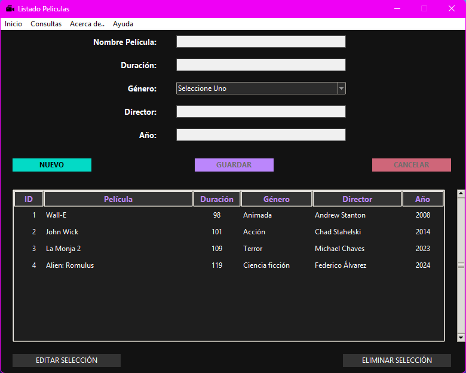

# 🎬 Catálogo de Películas - Python & SQLite (CRUD)

Este proyecto es una aplicación de escritorio desarrollada en Python que permite gestionar un catálogo de películas mediante operaciones CRUD (Crear, Leer, Actualizar y Eliminar). La interfaz gráfica cuenta con un diseño moderno en "Dark Mode".

## 📸 Vista Previa



✅ Características y Requisitos Implementados
El proyecto ha sido desarrollado siguiendo estrictamente las consignas técnicas solicitadas, destacando los siguientes puntos:

🗄️ Arquitectura de Base de Datos Relacional: Se implementó un modelo robusto en SQLite con 3 tablas vinculadas (Películas, Géneros y Directores) para garantizar la integridad y normalización de los datos.

🎨 Interfaz Gráfica (GUI) Moderna: Entorno intuitivo diseñado con Tkinter, aplicando estilos personalizados para una experiencia de usuario fluida y profesional en modo oscuro.

⚙️ Sistema CRUD Completo: Lógica integral para Crear, Leer, Actualizar y Eliminar registros con persistencia de datos en tiempo real.

📝 Formularios con Validación de Datos: Gestión exhaustiva que cumple con el requisito de 5 campos obligatorios por registro:
| Campo | Tipo de Dato | Origen |
| :--- | :--- | :--- |
| Título | Texto | Entrada manual |
| Año de estreno | Numérico | Entrada manual |
| Duración | Numérico | Entrada manual |
| Género | Relacional | Tabla Géneros |
| Director | Relacional | Tabla Directores |

🏗️ Arquitectura Modular (DAO): Organización del código basada en la separación de responsabilidades. Se separó la lógica de la interfaz (Vista) de la lógica de acceso a datos (Modelo/DAO), facilitando el mantenimiento y la escalabilidad del software.

## 📦 Estructura del Proyecto

Tal como se visualiza en el entorno de desarrollo:

```
TP-CATALOGOPELICULAS/
├── ddbb/                   # Base de datos SQLite
│   └── peliculas.db
├── img/                    # Recursos visuales e iconos
│   ├── captura_interfaz_principal.png
│   └── videocamara.ico
├── include/                # Componentes adicionales
│   └── menu.py             # Configuración de menús
├── modelo/                 # Capa de datos y lógica
│   ├── coneciondb.py       # Conexión técnica a la DB
│   └── consultas_dao.py    # Consultas CRUD
├── vista/                  # Interfaz de usuario
│   └── vista.py            # Lógica de la ventana principal
├── main.py                 # Punto de entrada de la aplicación
├── README.md               # Documentación
└── requirements.txt        # Dependencias del proyecto
```

## 💻 Requisitos

- Python 3.11 o superior
- Sistema operativo: Windows, Linux o macOS

## 🛠️ Instalación

1. **Clonar o descargar el proyecto**

```bash
git clone https://github.com/tu_usuario/TP-CatalogoPeliculas.git
cd TP-CatalogoPeliculas
```

2. **Crear un entorno virtual (opcional pero recomendado)**

```bash
python -m venv env
source env/bin/activate  # En Windows: env\Scripts\activate
```

3. **Instalar las dependencias**

```bash
pip install -r requirements.txt
```

4. **Ejecutar la aplicación**

```bash
python main.py
```

## 🛠️ Tecnologías Usadas

- Python 3.11
- Tkinter (Interfaz gráfica)
- SQLite (Base de datos)
- POO y organización modular en carpetas

---
