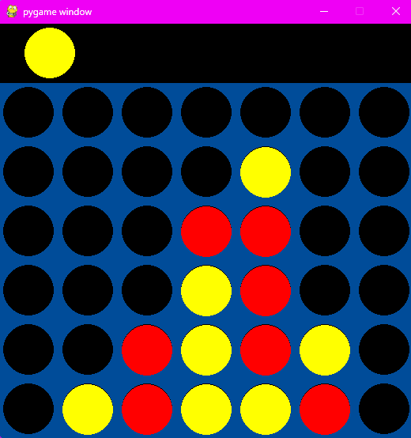

# 🎮 Proyecto: Conecta 4 (Python + Pygame)

Este es un desarrollo individual del clásico juego **Conecta 4**, implementado en Python utilizando la librería **Pygame** para la interfaz gráfica y **Numpy** para la lógica de la matriz del tablero.

## 📸 Vista Previa


## 🚀 Funcionalidades
* **Interfaz Gráfica:** Tablero interactivo con animaciones para las fichas.
* **Lógica de Juego:** Detección automática de victorias (horizontal, vertical y diagonales).
* **Multijugador Local:** Soporte para dos jugadores (Amarillo vs Rojo).

## 🛠️ Requisitos e Instalación

Para ejecutar este juego, necesitas tener instalado Python y las siguientes librerías:

1. **Instalar dependencias:**
   Asegúrate de tener el archivo `requirements.txt` en la carpeta y ejecuta:
```bash
   pip install -r requeriments.txt
```

2. **Ejecutar el juego:**
```bash
   python conecta_4.py
```

## 🕹️ **Como jugar:**

* **Movimiento:** Mueve el mouse hacia los lados para desplazar la ficha sobre las columnas.

* **Soltar ficha:** Haz clic izquierdo para soltar la pieza en la columna elegida.

* **Objetivo:** El primer jugador en alinear 4 fichas de su color (horizontal, vertical o diagonal) gana la partida.


